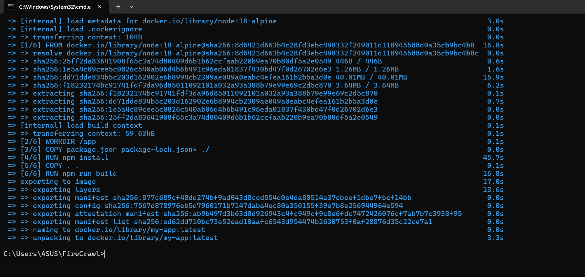
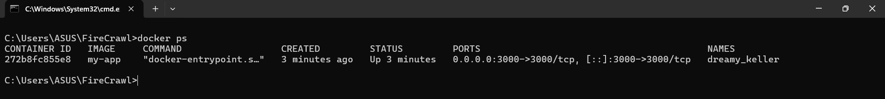
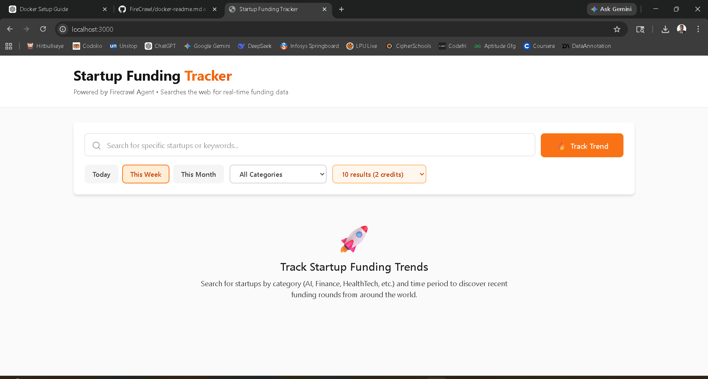

# 🐳 Assignment 1: Containerizing Applications with Docker

## 📌 Project Overview

This project demonstrates how to containerize a Node.js application using Docker.

---

## 🚀 Steps Performed

### 1. Clone Repository

```
git clone https://github.com/AnuragShukla19/docker-assignment
cd FireCrawl
```

### 2. Build Docker Image

```
docker build -t my-app .
```

### 3. Run Docker Container

```
docker run -d -p 3000:3000 --env-file .env.local my-app
```

### 4. Verify Running Container

```
docker ps
```

---

## 📸 Screenshots

### 🔹 Docker Image Build



---

### 🔹 Running Container



---

### 🔹 Running Application



---

## 🌐 Output

Application runs on:
http://localhost:3000

---

## 🛠️ Technologies Used

* Docker
* Node.js

---

## ✅ Conclusion

Successfully containerized and ran the application using Docker.
